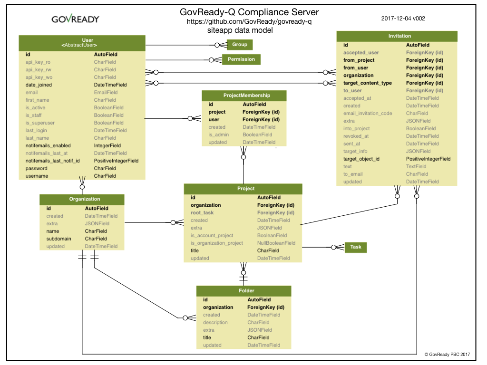
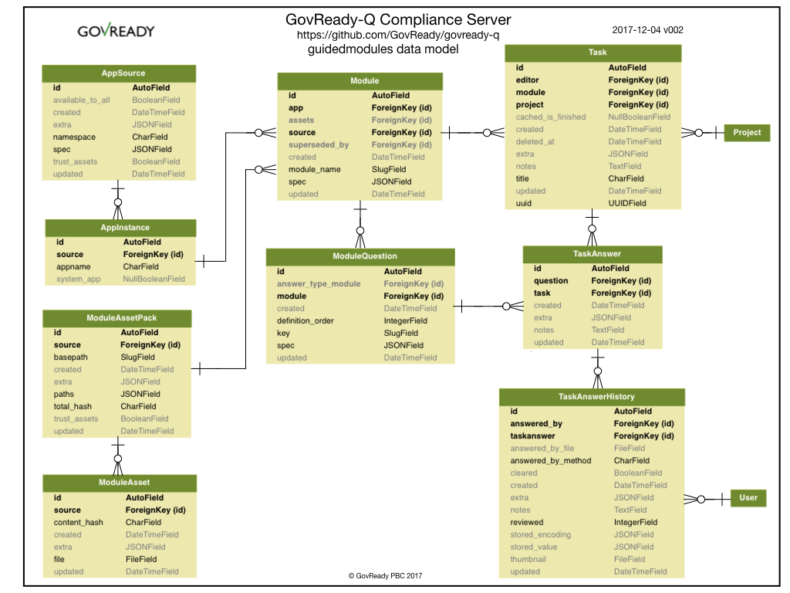

Deveoper Guide
================================

Documentation for developers of GovReady-Q Compliance Server.

# Overview

GovReady-Q Compliance Server is a GRC platform for creating automated compliance processes ranging from gathering information from persons and computers to generating compliance artifacts.

Unlike other GRC software, GovReady-Q was designed for modern software practices such as Agile, DevOps, and Infrastructure-as-Code.

The GovReady Compliance ecosystem consists of the following:

1. GovReady-Q Compliance Server - an open source server and collaboration platform gathering information and generating artifacts
1. GovReady Compliance Apps - customizable "images" of modules, questions, tasks, and artifact templates
1. GovReady Automation API - GovReady-Q Server's RESTful API for adding evidence and results
1. OpenControl - an emerging standard for expressing control implementation information in machine readable format
1. ComplianceLib - a Python library for modeling controls and control catalogs

# GovReady-Q Django Apps

The GovReady-Q Compliance Server is a Django Project consisting of three interacting Django Apps:

1. `siteapp` - handles users, organizations, projects and folders, invitations
1. `guidedmodules` - handles compliance apps, modules and questions (i.e., tasks), answers
1. `discussion` - handles discussions, comments, invitations

Both `siteapp` and `discussion` are fairly intuitive. The `guidedmodules` app is the most sophisticated and least intuitive of the three and provides the core functionality of the GovReady-Q Compliance Server.

## Siteapp

The diagram below provides a summary representation of GovReady-Q's Django siteapp data model that handles users, organizations, projects and folders, and invitations.



GovReady-Q is multi-tenant. The siteapp data model represents users who are uniquely associated with an oragnization and have membership in different organization projects. Users must be invited to projects.

Access control is based on organization and projects. Information cannot be shared acrossed organizations and only limited information can be shared across projects within an organization.


## Guidedmodules

The diagram below provides a summary representation of GovReady-Q's Django guidedmodules data model that handles compliance apps, modules and questions, (tasks,) answers. 



The best way to understand the guidedmodules data model is to think of a questionnaire containing multiple questions. Questions can be grouped into modules. Questions come in different types. Questions have answers.

This description suggests a simple "questionnaire-module-question-answer" database model, yet the diagram does not have tables for "Questionnaire" or "Question" or "Answer".

That's because we have a few special demands for our questionnaire that will require creative abstractions. Some of these additional demands are:

* blank questionaires are reusable and can be easily loaded into different installs of the database at different organizations;
* anyone can author questionnaires and blank questionnaires can be kept private or shared publicly;
* one questionnaire's answers can be accessed and used by another questionnaire if the questionnaires are part of the same project;
* arbitrary questionnaires can be associated with the same project; so we won't know up front which answers can be shared;
* support a question type whose answer is another questionnaire;
* allow blank questionnaires to be versioned, answered questionnaires to be updated in non-destructive ways, and to preserve answered questionnaires over the course of years,
* allow the answer to questions to change while preserving a complete history of answers,
* support assigning questionnaires and questions to different users to answer.

The first abstraction is to think of the "questionnaire" as more of a mini-application, or "app", that can could be extended to do more things than just ask questions and track answers. Apps are clearly reusable and easily loaded into different installs of the database and anyone can author them. When we install an app we have an instance of that app. Hence the `AppInstance` table. To enable our install of GovReady-Q to load both public and private apps, we track multiple sources of apps in the `AppSource` table.

The second abstraction is to think of a "question" also as a kind of "task" whose undertaking results in a value to be stored. When we assign a question (or a module of multiple questions) to a user, we task that user to produce a value that answers the question. Hence the tables `Task` and `TaskAnwser`. The `TaskAnswerHistory` table enables us to preserve a history of responses to a taskanswer. The field `stored_value` in the `TaskAnswerHistory` contains the actual response value to the task (e.g., the question's answer).

The simple "questionnaire-module-question-answer" model has now been transformed into a more abstract "app-module-task-taskanswer" model. 

To this "app-module-task-taskanswer" model we add relationships to deal with tasks whose taskanswer are other modules. And we add the `ModuleAssetPack` and `ModuleAsset` tables to track images and other assets our various modules of tasks might need.

This might all seem a long way from compliance, but it's not. Compliance is the discipline of scaling attestation and verification. To show compliance entities attest to completing multiple tasks in a manner that can be verified. Hence, "app-module-task-taskanswer".


## Discussion

The diagram below provides a summary representation of GovReady-Q's Django discussion data model that handles discussions, comments, and invitations.


A single discussion can be instantiated and associated to any task (task ~= "question"). A discussion can have multiple comments. Comments can have multiple attachments.


# Developer Tools

### Generating Detailed Data Models

Below are instructions to use `django-extensions` to generate detailed data models.

```
# Install django-extensions
# http://django-extensions.readthedocs.io/en/latest/installation_instructions.html
pip3 install django-extensions

# Add django-extensions INSTALLED_APPS in siteapp > settings.py
# INSTALLED_APPS = (
#    ...
#    'django_extensions',
# )

# You may need to install pyparsing
pip3 install pyparsing

# examples:
python3 manage.py graph_models -a -g -o my_project_visualized.png
python3 manage.py graph_models -a -o my_project.png
python3 manage.py graph_models -a > my_project.dot
# for a single django app:
python3 manage.py graph_models app1 -o my_project_app1.png
```

